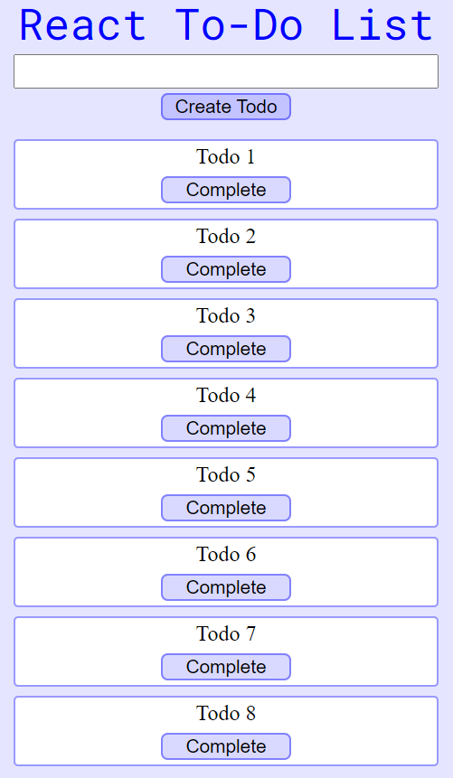

# React-Todo-List

Simple project to start getting into react development.

The todos are stored in the user's browser.

# Commands

[Commands](https://github.com/shrimp16/React-Todo-List/tree/main/todo-list)

# Technologies

  - VSCode
  - HTML
  - CSS
  - JavaScript
  - React
  - Styled Components
  
# Screenshots

  

